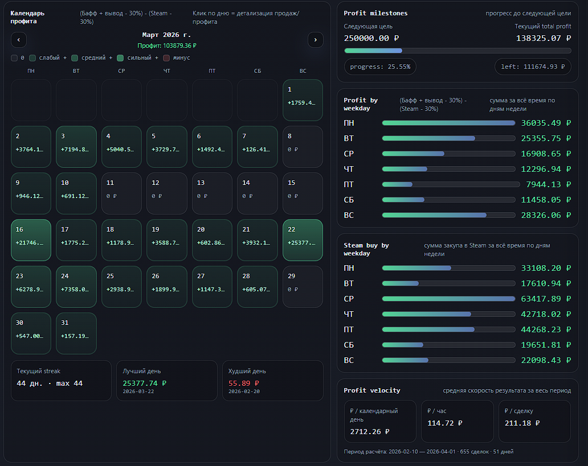
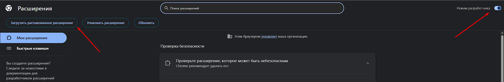

# [Merrel Bot](https://merrelbot.com) — Buff History Extension

---

---
## Установка расширения

1. Скачай папку с расширением на свой компьютер
2. Открой браузер (Chrome / Edge / Brave)
3. Перейди в настройки ресширений, для chrome это:

   ```
   chrome://extensions/
   ```
4. Включи **Режим разработчика (Developer mode)**
5. Нажми **Load unpacked / Загрузить распакованное расширение**
6. Выбери папку с расширением



---

## Подготовка

1. Зайди в аккаунт Buff, на котором продавались предметы через бота
2. Убедись, что ты **залогинен в этом же браузере**

---

## Использование расширения

1. Открой расширение
2. Выставь рекомендованные настройки:

   * **Собирать сделки:** `SUCCESS + DELIVERING`
   * **Экспорт:** `SUCCESS + DELIVERING`
3. Нажми **Сохранить**

---

## Настройка даты

1. Укажи дату, когда ты начал пользоваться ботом
2. Важно:

   * Дата **не должна быть раньше 27 января 2026 года**

---

## Сбор данных

1. Нажми **Добавить данные**
2. Дождись окончания парсинга

   * Не закрывай вкладку
   * Не выходи из аккаунта Buff

---

## Экспорт

1. После завершения нажми **Экспорт JSON**
2. Скачается файл с данными

---

## Анализ данных

1. Перейди на:

   ```
   https://merrelbot.com/anal
   ```

2. Получи историю покупок:

   * Открой Telegram-бота
   * Введи команду:

     ```
     /get_purchase_history raw
     ```
   * Скачай файл

3. На сайте:

   * Загрузите файл **purchased** (из Telegram)
   * Загрузите файл **JSON** (из расширения)

---

## Готово

После загрузки файлов сайт автоматически рассчитает аналитику. Учтите что сопоставление идет не с 100% шнасом. Если вы перекидывали предмет с аккаунта на аккаунт или даже отправляли, но не принимали трейд, то сопостовление будет затруднено.

Telegram - https://t.me/merrel37
Telegram Manager - https://t.me/Merrelbotsupport
Site - https://merrelbot.com